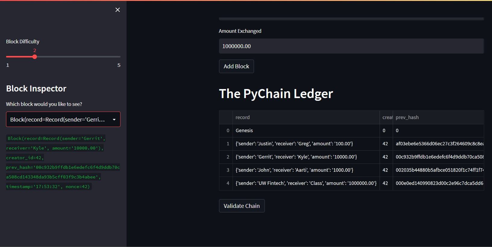
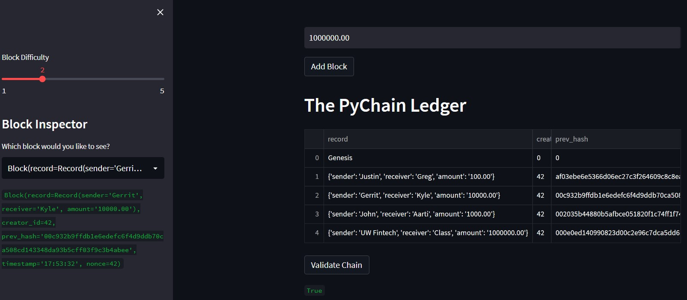
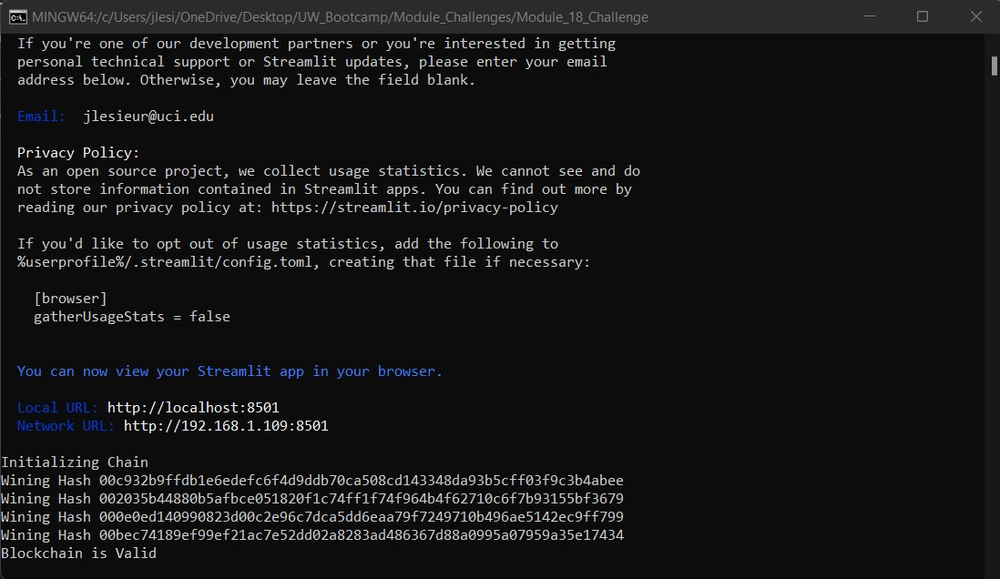

# Module_18_Challenge - Blockchain With Python

This exercise on building Blockchain Ledgers demonstrates usage of the Streamlit, dataclasses, and typing packages. These packages paired with the datetime and hashlib packages allow one to build Blockchain ledger from user inputs, creating a historical record of transactions.

---

## Discussion

### Blockchain Ledger Result



### Blockchain Validation Result in Web App



### Blockchain Validation Result in Terminal 



---

## Technologies

This project leverages python 3.10 with the following packages:

* [pandas](https://github.com/pandas-dev/pandas) - For available packages within pandas.

* [dataclasses](https://docs.python.org/3/library/dataclasses.html) - For available packages within dataclasses.

* [typing](https://docs.python.org/3/library/typing.html) - For available packages within typing.

* [datetime](https://docs.python.org/3/library/datetime.html) - For available packages within datetime.

* [streamlit](https://docs.streamlit.io/) - For packages within streamlit.

* [hashlib](https://docs.python.org/3/library/hashlib.html) - For packages within hashlib.

---

## Installation Guide

This application requires you first install the following dependencies to run correctly.

```python
  pip install pandas
  pip install streamlit
```

---

## Usage

To use the blockchain tool simply clone the repository and run the **pychain.py** with:

```Visual Studio
streamlit pychain.py
```

Upon launching the Blockchain Web App, you will see user input fields to log their transactions.

---

## Contributors

***Brought to you by World Reknowned Blockchain Transaction Network at LeSieur Technologies***

---

## License

```LICENSE PENDING```